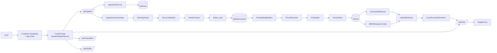

# RAG_QA_System


---

## 1. Project Title

**RAG_QA_System**: a FastAPI-based Retrieval-Augmented Generation (RAG) system focused on document ingestion and retrieval quality.

---

## 2. Overview

RAG_QA_System is structured around a document QA workflow where uploaded files are parsed, chunked, enriched, and prepared for semantic/keyword retrieval. The project currently includes production-style ingestion and retrieval building blocks, while answer generation is scaffolded and returns placeholder responses.

---

## 3. Quickstart

### 3.1 Setup

```bash
# 1) Clone and enter the repository
git clone <your-repo-url>
cd RAG_QA_System

# 2) Create and activate a virtual environment
python -m venv .venv

# Windows (PowerShell)
.venv\Scripts\Activate.ps1

# Linux/macOS
# source .venv/bin/activate

# 3) Install dependencies
pip install -r requirements.txt
````

### 3.2 Start Services

```bash
# Start Qdrant (optional but recommended)
docker run -p 6333:6333 qdrant/qdrant
```

### 3.3 Run Application

```bash
uvicorn backend.app.main:app --reload
```

### 3.4 Access Endpoints

* `http://127.0.0.1:8000/`
* `http://127.0.0.1:8000/chat`
* `http://127.0.0.1:8000/api/health`

---

## 4. Features

* FastAPI web app with HTML + API routes
* Document ingestion pipeline
* Hybrid retrieval (semantic + BM25)
* Chunk enrichment for metadata-aware search
* Retrieval evaluation metrics (Recall@K, MRR@K, nDCG@K)

---

## 5. Architecture

### 5.1 System Architecture (Mermaid)



### 5.2 Pipeline Breakdown

#### 5.2.1 Upload Flow

* File stored in `data/raw`
* Parsed and structured
* Chunked and flattened
* Saved in `data/processed`

#### 5.2.2 Retrieval Flow

* Embeddings generated
* Stored in Qdrant
* Retrieved via:

  * Semantic
  * BM25
  * Hybrid fusion
  * Reranking

#### 5.2.3 Generation Flow

* Scaffolded via `RagService`
* `/api/chat` not yet implemented

---

## 6. Tech Stack

* Python 3.10+
* FastAPI + Uvicorn
* Jinja2
* Pydantic
* Docling
* SentenceTransformers + PyTorch
* Qdrant
* rank-bm25
* KeyBERT
* NumPy

---

## 7. Project Structure

| Path                    | Role        | Key Contents         |
| ----------------------- | ----------- | -------------------- |
| backend/app/main.py     | Entry point | App init             |
| backend/app/api/routes/ | API layer   | health, upload, chat |
| backend/app/ingestion/  | Processing  | parser, chunker      |
| backend/app/indexing/   | Embeddings  | vector store         |
| backend/app/retrieval/  | Retrieval   | semantic, BM25       |
| backend/app/generation/ | Generation  | prompt, pipeline     |
| backend/app/services/   | Services    | ingestion, rag       |
| backend/evaluation/     | Evaluation  | metrics              |
| frontend/templates/     | UI          | HTML                 |
| data/raw/               | Input       | uploaded files       |
| data/processed/         | Output      | processed chunks     |

---

## 8. Installation

### 8.1 Prerequisites

* Python 3.10+
* Qdrant running on `localhost:6333`

### 8.2 Install Dependencies

```bash
pip install -r requirements.txt
```

---

## 9. Usage

```bash
uvicorn backend.app.main:app --reload
```

### 9.1 Health Check

```bash
curl http://127.0.0.1:8000/api/health
```

---

## 10. Example Workflow

1. Start Qdrant
2. Run FastAPI app
3. Open `/chat`
4. Upload document
5. Check processed files
6. Run retrieval
7. Integrate generation

---

## 11. Configuration

### 11.1 Environment Variables

* `GOOGLE_API_KEY`
* `GEMINI_API_KEY`

### 11.2 Defaults

* Qdrant Host: `localhost`
* Port: `6333`
* Collection: `documents`

---

## 12. Future Improvements

* Implement full `/api/chat` generation
* Add citation grounding
* CI/CD integration
* Pytest-based testing
* Docker Compose setup
