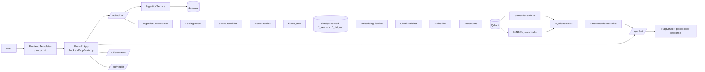

# RAG_QA_System


## Project Title
RAG_QA_System: a FastAPI-based Retrieval-Augmented Generation (RAG) system focused on document ingestion and retrieval quality.

## Overview
RAG_QA_System is structured around a document QA workflow where uploaded files are parsed, chunked, enriched, and prepared for semantic/keyword retrieval. The project currently includes production-style ingestion and retrieval building blocks, while answer generation is scaffolded and returns placeholder responses.

## Quickstart
```bash
# 1) Clone and enter the repository
git clone <your-repo-url>
cd RAG_QA_System

# 2) Create and activate a virtual environment
python -m venv .venv
# Windows (PowerShell)
.venv\Scripts\Activate.ps1
# Linux/macOS
# source .venv/bin/activate

# 3) Install dependencies
pip install -r requirements.txt

# 4) (Optional but recommended for retrieval) Start Qdrant
docker run -p 6333:6333 qdrant/qdrant

# 5) Run the app
uvicorn backend.app.main:app --reload
```

Then open:
- `http://127.0.0.1:8000/`
- `http://127.0.0.1:8000/chat`
- `http://127.0.0.1:8000/api/health`

## Features
- FastAPI web app with HTML routes and API routes (`/api/health`, `/api/upload`, `/api/chat`, `/api/evaluation`).
- Document ingestion pipeline with parsing, structure building, chunking, and flattening.
- Retrieval stack with semantic search, BM25 retrieval, and hybrid fusion.
- Chunk enrichment for metadata/keyword-aware retrieval.
- Retrieval evaluation utilities (Recall@K, MRR@K, nDCG@K).

## Architecture / How it Works
### System Architecture (Mermaid)


### Retrieval + Generation Pipeline
1. Upload flow (`POST /api/upload`):
   - File is stored under `data/raw` via `IngestionService`.
   - `IngestionOrchestrator` parses and structures the document using `DoclingParser`, `StructureBuilder`, and `NodeChunker`.
   - Tree and flat chunk artifacts are saved to `data/processed`.
2. Retrieval flow:
   - Chunks can be enriched and embedded through `EmbeddingPipeline`.
   - Embeddings and payloads are stored in Qdrant (`VectorStore`).
   - Query-time retrieval is supported by semantic (`SemanticRetriever`), lexical (`BM25Retriever`), and fusion (`HybridRetriever`) components, with optional reranking.
3. Generation flow:
   - `RagService` and generation utilities exist, but `POST /api/chat` currently returns `"Not implemented yet."`.

## Tech Stack
- Python 3.10+
- FastAPI + Uvicorn
- Jinja2 (template rendering)
- Pydantic
- Docling + `docling-core`
- SentenceTransformers + PyTorch
- Qdrant (`qdrant-client`)
- `rank-bm25`
- KeyBERT
- NumPy

## Project Structure
| Path | Role | Key Contents |
|---|---|---|
| `backend/app/main.py` | FastAPI entrypoint | App init, static mount, HTML route registration, API router inclusion |
| `backend/app/api/routes/` | HTTP API layer | `health.py`, `upload.py`, `chat.py`, `evaluation.py` |
| `backend/app/ingestion/` | Document processing pipeline | `docling_parser.py`, `structure_builder.py`, `node_chunker.py`, `tree_flattener.py`, `orchestrator.py`, `enrichment.py` |
| `backend/app/indexing/` | Embeddings + vector storage | `embedder.py`, `vector_store.py`, `schema_manager.py`, `keyword_index.py` |
| `backend/app/retrieval/` | Query-time retrieval logic | `semantic_retriever.py`, `bm25_retriever.py`, `hybrid_retriever.py`, `reranker.py`, `strategy_controller.py` |
| `backend/app/generation/` | Generation scaffolding | `prompt_builder.py`, `context_builder.py`, `generator.py`, `citation_manager.py`, `pipeline.py` |
| `backend/app/models/` | Shared data models | `document.py`, `chunk.py`, `query.py`, `response.py`, `document_structure.py` |
| `backend/app/services/` | Service layer | `ingestion_service.py`, `rag_service.py`, `retrieval_service.py` |
| `backend/evaluation/` | Retrieval evaluation | `metrics.py`, `evaluator.py`, `test_queries.json` |
| `backend/tests/` | Test and benchmark scripts | retrieval, ingestion, generation, and evaluation tests |
| `frontend/templates/` | UI templates | `index.html`, `chat.html`, reusable component partials |
| `frontend/static/` | Frontend assets | CSS and JS for interactions/animations |
| `data/raw/` | Uploaded source documents | Input files saved before processing |
| `data/processed/` | Processed artifacts | Generated `*_tree.json` and `*_flat.json` outputs |
| `requirements.txt` | Root Python dependencies | Unified dependency list for running the project |

## Installation
### Prerequisites
- Python 3.10+
- Qdrant instance at `localhost:6333` for retrieval/indexing features

### Install dependencies
```bash
pip install -r requirements.txt
```

## Usage / How to Run
```bash
uvicorn backend.app.main:app --reload
```

Optional API check:
```bash
curl http://127.0.0.1:8000/api/health
```

## Example Workflow
1. Start Qdrant (if you want semantic/hybrid retrieval enabled).
2. Start the FastAPI app.
3. Open `/chat`.
4. Upload a document through UI or `POST /api/upload`.
5. Verify generated artifacts in `data/processed/`.
6. Run retrieval modules against indexed chunks.
7. Integrate retrieval context with generation once `RagService` is completed.

## Configuration
- Environment variables (read in `backend/app/core/config.py`):
  - `GOOGLE_API_KEY`
  - `GEMINI_API_KEY`
- Retrieval defaults:
  - Qdrant host: `localhost`
  - Qdrant port: `6333`
  - Collection: `documents`
- Model defaults are configured in class constructors (for embedding and reranking components).

## Future Improvements
- Implement end-to-end answer generation for `/api/chat`.
- Wire generation modules with retrieval context and citation grounding.
- Add CI badges (tests/lint) once automated workflows are available.
- Expand tests into a standard pytest suite with fixtures.
- Finalize `docker-compose.yml` for one-command local setup.
