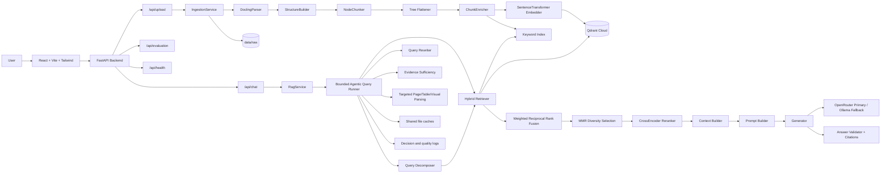

# RAG QA System


RAG QA System is a full-stack Agentic Retrieval-Augmented Generation application
for asking grounded questions over uploaded documents. The system is evolving
from a linear RAG pipeline into an evidence-first agent that decides how to
retrieve, inspect, verify, and assemble context before generating an answer.

The current implementation provides the first backend slice of that design:
structure-aware ingestion, hybrid vector and keyword retrieval, typed query
planning, bounded retries, evidence sufficiency checks, targeted page parsing,
grounded generation, citations, confidence, and source metadata.

## Live Deployment

The project has been deployed to the cloud using:

- **Vercel** for the React frontend.
- **Render** for the FastAPI backend.
- **Qdrant Cloud** for the managed vector database.

The backend can also serve the compiled frontend from `frontend/dist` when the Vite production build exists, which is useful for single-service container deployments.

## Architecture


```mermaid
flowchart LR
    U[User] --> FE[React + Vite + Tailwind]
    FE --> API[FastAPI Backend]

    API --> UP["/api/upload"]
    API --> CH["/api/chat"]
    API --> EV["/api/evaluation"]
    API --> HL["/api/health"]

    UP --> ING[IngestionService]
    ING --> RAW[(data/raw)]
    ING --> PARSE[DoclingParser]
    PARSE --> TREE[StructureBuilder]
    TREE --> CHUNK[NodeChunker]
    CHUNK --> FLAT[Tree Flattener]
    FLAT --> ENRICH[ChunkEnricher]
    ENRICH --> EMB[SentenceTransformer Embedder]
    EMB --> QD[(Qdrant Cloud)]
    ENRICH --> KW[Keyword Index]

    CH --> RAG[RagService]
    RAG --> AGENT[Bounded Agentic Query Runner]
    AGENT --> DECOMP[Query Decomposer]
    AGENT --> REWRITE[Query Rewriter]
    AGENT --> RET[Hybrid Retriever]
    AGENT --> EVAL[Evidence Sufficiency]
    AGENT --> PAGE[Targeted Page/Table/Visual Parsing]
    DECOMP --> RET
    RET --> QD
    RET --> KW
    RET --> RRF[Weighted Reciprocal Rank Fusion]
    RRF --> MMR[MMR Diversity Selection]
    MMR --> RR[CrossEncoder Reranker]
    RR --> CTX[Context Builder]
    CTX --> PROMPT[Prompt Builder]
    PROMPT --> GEN[Generator]
    GEN --> LLM[OpenRouter Primary / Ollama Fallback]
    GEN --> VAL[Answer Validator + Citations]

    AGENT --> CACHE[Shared file caches]
    AGENT --> OBS[Decision and quality logs]
```

## Features

- Full-stack document Q&A app with FastAPI, React, Vite, Tailwind CSS, and Axios.
- Upload flow that stores source files under `data/raw`.
- Document parsing with Docling for PDF/DOCX/XLSX and a lightweight parser for Markdown/TXT.
- Hierarchical document processing using structure building, list-aware semantic node chunking, tree flattening, and metadata propagation.
- Chunk enrichment with KeyBERT keywords, language metadata, hierarchy paths, importance scores, page numbers, and source file data.
- SentenceTransformer embeddings with local embedding cache under `data/embeddings`.
- Qdrant Cloud vector database integration with metadata filtering and collection auto-creation.
- Keyword retrieval using a persisted, versioned BM25 index with fingerprint validation.
- Hybrid retrieval with dynamic dense/keyword weighting, weighted Reciprocal Rank Fusion (RRF), multi-query expansion, deduplication, and MMR selection.
- Batched BGE sentence encoding for semantic boundaries and deterministic UUID5 chunk IDs for repeatable re-indexing.
- Cross-encoder reranking with `cross-encoder/ms-marco-MiniLM-L-6-v2`.
- Query rewriting, query decomposition, and a controlled multi-hop follow-up step.
- Bounded agentic query planning that selects retrieval, rewriting, decomposition,
  evidence evaluation, and targeted page parsing before generation.
- RAG generation pipeline with context building, prompt construction, model routing, validation, citations, confidence scores, and source metadata.
- OpenRouter as the primary LLM provider with Ollama fallback support.
- File-based LLM cache and response cache under `data/cache`.
- Application logging to console and `backend/logs/app.log`.
- Standard API response envelope for success and error responses.
- Health checks for application status, LLM configuration, and Qdrant connectivity.
- Evaluation utilities for retrieval and generation quality.
- Dockerized backend image that builds the frontend and serves the SPA from FastAPI.

## Agentic RAG Design

The target architecture is organized into three query-time planes and two
cross-cutting layers:

### 1. Ingestion plane

Before query time, uploaded documents pass through:

```text
source document
  -> page scanning and high-level structural parsing
  -> structure-aware chunking and metadata enrichment
  -> shared embeddings
  -> Qdrant vector store + persisted BM25 keyword index
```

The canonical evidence model preserves document, page, region, parser,
confidence, and provenance metadata. Ordinary pages follow the inexpensive
native-text path; pages flagged for tables or visuals can be parsed selectively.

### 2. Agentic query plane

At query time, `AgenticQueryRunner` acts as the retrieval/orchestration agent:

1. Classifies the query and selects an initial retrieval strategy.
2. Decomposes complex or multi-part questions into at most
   `AGENT_MAX_SUBQUERIES` subqueries.
3. Searches the hybrid vector and keyword indexes with tenant, workspace, and
   document filters.
4. Evaluates query-term coverage, evidence count, page diversity, and provenance.
5. For weak evidence, performs a bounded query rewrite and retrieval retry.
6. For table, figure, chart, or visual questions, can invoke targeted page
   parsing when canonical page storage is available.
7. Sends only selected evidence to reranking, context assembly, and generation.

The loop is deliberately bounded by `AGENT_MAX_ATTEMPTS` and does not silently
generate an ungrounded answer. If evidence remains insufficient, the API
returns a grounded “I don't know based on the available evidence” response with
confidence, reasons, and any valid sources gathered.

### 3. Knowledge and tools

Implemented tools:

- Qdrant semantic/vector retrieval
- Persisted BM25 keyword retrieval
- Hybrid fusion, MMR, and optional cross-encoder reranking
- Canonical page and region evidence lookup
- Selective table and visual parsing hooks

SQL retrieval, web search, OCR/VLM specialists, and domain-specific tools are
planned extensions. The agent action boundary is designed so these capabilities
can be registered later without changing the `/api/chat` contract.

### Shared cache layer

The current system uses separate file-backed caches for embeddings, LLM
responses, chat responses, and selected page/region evidence. These reduce
duplicate computation and cost while retaining deterministic local behavior.

### Observability layer

Current logging records retrieval and generation events, provider selection,
cache hits, evidence sufficiency, and agent plan/decision counts. A future
production layer will expose these as Prometheus metrics, Grafana dashboards,
distributed traces, agent decision traces, and RAG quality signals.

## Tech Stack

| Area | Tools |
| --- | --- |
| Backend | Python, FastAPI, Uvicorn, Pydantic |
| Frontend | React 18, Vite, Tailwind CSS, Framer Motion, Lucide React |
| Parsing | Docling, custom Markdown/TXT parser |
| Embeddings | SentenceTransformers, BAAI BGE models |
| Vector DB | Qdrant Cloud |
| Retrieval | Dense search, BM25 keyword search, weighted RRF fusion, MMR |
| Reranking | SentenceTransformers CrossEncoder |
| Generation | OpenRouter, Ollama fallback |
| Evaluation | Pytest, retrieval metrics, generation evaluators |
| Deployment | Vercel, Render, Qdrant Cloud, Docker |

## Project Structure

| Path | Purpose |
| --- | --- |
| `backend/app/main.py` | FastAPI app setup, CORS, logging middleware, exception handlers, SPA mounting |
| `backend/app/api/routes/` | API routes for chat, upload, health, and evaluation |
| `backend/app/api/responses.py` | Shared success/error API response envelope |
| `backend/app/core/` | Config, constants, logging, model registry, LLM cache, response cache |
| `backend/app/models/` | Pydantic models for chunks, page manifests, canonical evidence, documents, queries, responses, and LLM providers |
| `backend/app/services/` | High-level ingestion, retrieval, and RAG services |
| `backend/app/ingestion/` | Page scanning, canonicalization, Docling parser, structure builder, node chunker, enrichment, tree flattening |
| `backend/app/indexing/` | Embedder, Qdrant vector store, schema manager, keyword index |
| `backend/app/retrieval/` | Semantic retriever, BM25/keyword retriever, hybrid retriever, reranker, query analysis/rewrite/decomposition |
| `backend/app/agent/` | Typed agent plan/decision models and bounded retrieval orchestration loop |
| `backend/app/generation/` | Context builder, prompt builder, generator, citation manager, answer validator, generation pipeline |
| `backend/evaluation/` | Retrieval metrics, generation metrics, full evaluation runner, datasets |
| `backend/tests/` | Tests for ingestion, retrieval, generation, evaluation, full pipeline, and API contract |
| `frontend/src/` | React app, pages, reusable UI components, API client, styles |
| `data/raw/` | Uploaded source documents |
| `data/cache/` | Runtime response and LLM caches |
| `docker-compose.yml` | Backend service for local containerized running |
| `backend/Dockerfile` | Multi-stage Docker build for frontend + backend |

### Dependency Profiles

The root `requirements.txt` installs the pinned core profile from `requirements-core.txt`. Optional capabilities are isolated so the base deployment does not inherit the heavier infrastructure stack:

```text
requirements-core.txt      API, parsing, retrieval, Stage 1 scanner, tests
requirements-agent.txt     LangGraph and LangChain core
requirements-storage.txt   S3, PostgreSQL, Redis
requirements-workflow.txt  Temporal background workflows
requirements-visual.txt    Specialist visual-parser placeholders
```

Install only the profile required by the deployment. The visual profile intentionally leaves MinerU and PaddleOCR commented out because their Python/CUDA compatibility changes independently and they should be added after document evaluation.

### Ingestion and Chunking

The ingestion path is structure-aware and does not merge content across heading nodes:

```text
DoclingParser
  -> StructureBuilder
  -> StructureFragment paragraphs/list groups
  -> NodeChunker
  -> metadata-complete flatten_tree()
  -> ChunkEnricher
  -> shared BGE Embedder
  -> Qdrant + BM25
```

`NodeChunker` uses the tokenizer associated with `BAAI/bge-large-en-v1.5`, batches sentence embeddings according to `EMBEDDING_BATCH_SIZE`, and applies semantic similarity plus hard token limits. Consecutive list items are grouped before chunking and remain together unless the group exceeds the configured maximum.

Flattened chunks receive document identity, source, hierarchy, page number when available, deterministic chunk indexes, and token counts. Final vector-store IDs are UUID5 values derived from the document, hierarchy, position, and content hash. Re-ingestion of an unchanged document therefore produces the same IDs.

### Hybrid Retrieval

The retrieval service queries Qdrant and the persisted BM25 index with the same query and optional metadata filters. Results are validated, deduplicated, ranked deterministically, and fused with weighted Reciprocal Rank Fusion. Dense retrieval failures are logged and fall back to sparse retrieval; results are then adjusted by the existing hierarchy heuristic and passed through vector-aware MMR. Cross-encoder reranking remains optional and runs after hybrid fusion.

The BM25 index is stored at `data/index/bm25.json`, includes a schema version and corpus fingerprint, and is atomically replaced under a file lock. A corrupted or stale index is rejected and rebuilt by subsequent ingestion. Existing documents should be re-indexed once after enabling persistence.

### Stage 1: Canonical Document and Page Manifest

Stage 1 introduces an application-owned document boundary before semantic chunking:

```text
PDF -> PageScanner (PyMuPDF) -> DocumentManifest -> Canonicalizer -> EvidenceItem
                                      |
                                      +-> page text, signals, statistics, bbox, provenance
```

`PageScanner` is a bounded, cheap first pass for PDF, Markdown, and TXT. For PDFs it records page text, text blocks, block bounding boxes, dimensions, image counts, and initial scanned/image signals without running OCR or a visual model. For Markdown it creates logical section pages; TXT becomes one logical page. `Canonicalizer` converts these manifests into stable `EvidenceItem` records so downstream retrieval and agent tools do not depend directly on parser-specific objects.

The canonical evidence contract supports text, tables, figures, charts, images, formulas, and captions. Stage 1 populates text evidence with page/section provenance; specialist table, layout, OCR, and visual adapters are intentionally deferred until Stage 2 routing identifies pages that need them. Manifests include a schema version and source hash and are atomically persisted and reused when the source is unchanged.

### Stage 2: Cheap Page Scanning and Routing

Stage 2 extends the first pass into a bounded routing layer:

```text
Document -> PageScanner -> PageManifest -> PageRoutingPolicy
                                      |
                                      +-> native text path for ordinary pages
                                      +-> OCR/table/visual actions for flagged pages
```

The scanner now records PDF page count, rotation, dimensions, text blocks and bounding boxes, image counts, text density, numeric-token counts, heading/list signals, and conservative table/chart/formula signals. Markdown is represented as logical section pages and TXT as a logical page sequence. Manifests contain a schema version, scanner version, source SHA-256, timestamp, and are atomically persisted and reused when the source is unchanged.

`PageRoutingPolicy` is deliberately separate from scanning. It records actions such as `use_native_text`, `parse_ocr`, `parse_table`, and `parse_visual`. Ordinary PDF pages use the cheap manifest-backed document path. Flagged pages are grouped into contiguous ranges and passed to Docling through `PdfPipelineOptions.page_range`; native pages and selectively parsed pages are combined before chunking. OCR, VLM, and specialist table implementations remain explicit routing actions until their dependencies are installed and registered.

## API Contract

All API responses use the same envelope.

Success:

```json
{
  "success": true,
  "data": {},
  "error": null
}
```

Error:

```json
{
  "success": false,
  "data": null,
  "error": "Safe error message"
}
```

### `GET /api/health`

Returns app status, version, and dependency availability.

```json
{
  "success": true,
  "data": {
    "status": "healthy",
    "version": "1.0.0",
    "services": {
      "llm": true,
      "qdrant": true
    }
  },
  "error": null
}
```

### `POST /api/upload`

Accepts a multipart file upload, saves it to `data/raw`, parses it, chunks it, enriches it, embeds it, stores vectors in Qdrant, and adds chunks to the keyword index.

Supported local parser paths:

- `.md`
- `.markdown`
- `.txt`
- `.pdf`
- `.docx`
- `.xlsx`

### `POST /api/chat`

Request:

```json
{
  "message": "Ask a question about the uploaded documents"
}
```

Response:

```json
{
  "success": true,
  "data": {
    "answer": "...",
    "citations": [],
    "confidence": 0.87,
    "sources": []
  },
  "error": null
}
```

### `POST /api/evaluation`

Current API route returns a pending status. The evaluation implementation lives under `backend/evaluation`.

## Local Setup

### Prerequisites

- Python 3.10+
- Node.js 18+
- Qdrant Cloud URL and API key
- OpenRouter API key, or a reachable Ollama server

### Backend

```bash
python -m venv .venv
.venv\Scripts\Activate.ps1
pip install -r requirements.txt
uvicorn backend.app.main:app --reload
```

The backend runs on `http://localhost:8000`.

### Frontend

```bash
cd frontend
npm install
npm run dev
```

The frontend runs on `http://localhost:3000`. During development, Vite proxies `/api` requests to `http://localhost:8000` unless `VITE_API_PROXY_TARGET` is changed.

## Environment Variables

Create a `.env` file in the repository root.

```env
APP_NAME=Enterprise RAG QA System
APP_VERSION=1.0.0
DEBUG=false

OPENROUTER_API_KEY=
OPENROUTER_MODEL=google/gemini-2.0-flash-001

OLLAMA_MODEL=llama3:8b
OLLAMA_BASE_URL=http://localhost:11434

QDRANT_URL=https://your-cluster.cloud.qdrant.io
QDRANT_API_KEY=
QDRANT_COLLECTION=rag_documents

DEFAULT_TOP_K=5
AGENT_INITIAL_TOP_K=10
AGENT_MAX_ATTEMPTS=2
AGENT_MAX_SUBQUERIES=3
LOG_LEVEL=INFO

CHUNK_MAX_TOKENS=400
CHUNK_MIN_TOKENS=100
CHUNK_SIMILARITY_THRESHOLD=0.70
EMBEDDING_BATCH_SIZE=32
ENABLE_KEYWORD_EXTRACTION=true
TOP_K_KEYWORDS=5
```

`EMBEDDING_MODEL` defaults to `BAAI/bge-large-en-v1.5`. The model is shared through the embedding provider across chunking, enrichment, and final embedding. Changing the embedding model or vector dimension requires deleting/recreating the Qdrant collection and re-indexing documents; existing deterministic IDs do not migrate old records automatically.

Frontend override:

```env
VITE_API_URL=https://your-render-backend-url
VITE_API_PROXY_TARGET=http://localhost:8000
```

## Docker

Build and run the backend container:

```bash
docker compose up --build
```

The Docker image:

- Builds the React frontend with Node.
- Builds Python dependencies in a separate stage.
- Runs FastAPI with Uvicorn on port `8000`.
- Serves the compiled SPA from `frontend/dist`.
- Persists logs and runtime data through mounted `backend/logs` and `data` folders.
- Includes a container health check for `/api/health`.

## Evaluation and Tests

Run the test suite from the configured Conda environment:

```powershell
conda run -n genai-env pytest backend/tests
```

The evaluation layer includes:

- Retrieval metrics: Recall@K, MRR@K, nDCG@K.
- Generation evaluation helpers.
- Full pipeline evaluation over files in `data/raw`.
- API contract tests for normalized chat success, error, and validation responses.

Some tests and evaluation paths require Qdrant Cloud and an LLM provider to be configured.

## Current Limitations

- `/api/chat` is currently non-streaming.
- The keyword index is persisted as a versioned BM25 file and still requires
 re-indexing when the embedding/indexing configuration changes.
- Uploaded documents are stored on local/container disk, not object storage.
- The evaluation API route is present, but the full evaluator is currently used from backend modules/scripts.
- The app uses simple file-based caches for LLM and chat responses.
- Authentication, rate limiting, and tenant/user isolation are not implemented yet.
- SQL and web-search tools are not connected yet; current agent tools are local
  vector, keyword, evidence, and targeted parsing capabilities.

## Future Work

Planned learning and implementation order:

### Immediately

- Complete the agent tool registry and add SQL/web-search adapters.
- Add structured Prometheus/Grafana metrics for agent decisions and RAG quality.
- Add async execution for long-running retrieval and ingestion paths.
- Add Redis/Celery for background ingestion and retrieval work.
- Add streaming responses.

### Then

- LangSmith
- OpenTelemetry
- Durable conversation and agent decision history

### Next

- vLLM
- Quantization
- Intelligent routing
- Local embeddings

### After That

- Kubernetes
- Helm
- Distributed workers
- Ray Serve

### Later

- TensorRT
- CUDA fundamentals
- GPU profiling
- Kafka

## Production Roadmap

- Complete the three-plane architecture: ingestion, agentic query
  orchestration, and knowledge/tools.
- Add a tool registry for vector DB, SQL, web search, selective parsers, APIs,
  calculations, and domain-specific capabilities.
- Add explicit evidence grading, confidence calibration, and re-plan policies
  based on answer quality rather than retrieval count alone.
- Add streaming chat responses for lower perceived latency.
- Move long-running ingestion/indexing work to Celery workers backed by Redis.
- Add durable object storage for uploaded source files.
- Add Prometheus metrics, Grafana dashboards, and OpenTelemetry traces.
- Add LangSmith tracing/evaluation for prompt and retrieval debugging.
- Improve model routing across hosted APIs, local models, and specialized providers.
- Support local embedding deployments and quantized inference.
- Add Kubernetes/Helm deployment manifests.
- Add distributed ingestion/retrieval workers and Ray Serve experiments.
- Add GPU-focused optimization work with TensorRT, CUDA basics, and profiling.
- Add Kafka for event-driven ingestion and pipeline coordination.

## Current Validation

The current agentic runner and retrieval regression tests pass in the
`genai-env` Conda environment:

```powershell
conda run -n genai-env pytest -q `
  backend/tests/test_agent_runner.py `
  backend/tests/test_evidence_workflow.py `
  backend/tests/test_retrieval_modes.py
```

The full API test suite also requires a configured LLM provider for tests that
exercise the application dependency graph. Configure OpenRouter or Ollama
before running the complete suite.
